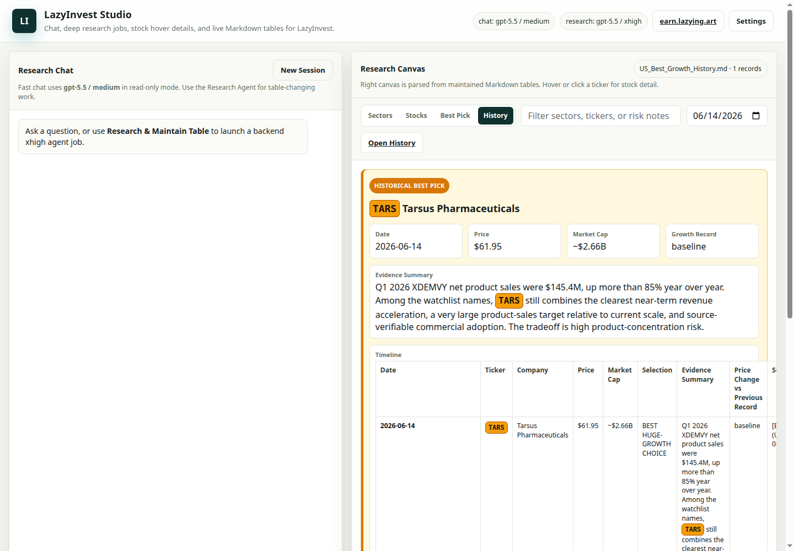
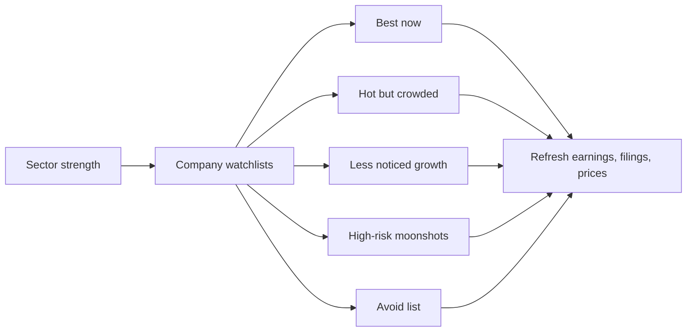

[English](README.md) · [العربية](i18n/README.ar.md) · [Español](i18n/README.es.md) · [Français](i18n/README.fr.md) · [日本語](i18n/README.ja.md) · [한국어](i18n/README.ko.md) · [Tiếng Việt](i18n/README.vi.md) · [中文 (简体)](i18n/README.zh-Hans.md) · [中文（繁體）](i18n/README.zh-Hant.md) · [Deutsch](i18n/README.de.md) · [Русский](i18n/README.ru.md)

[](https://github.com/lachlanchen/lachlanchen/blob/main/figs/banner.png)

# LazyInvest

*A multilingual public workspace for dated U.S. stock, sector, and underfollowed-growth research.*

[](https://earn.lazying.art)
[](US_Sector_Investment_Matrix_2026-06-13.md)
[](https://github.com/sponsors/lachlanchen)



LazyInvest collects investment research notes that separate current sector strength, crowded momentum, less-noticed growth candidates, high-risk moonshots, and avoid-list companies. The repository is designed to be easy to refresh: each note is dated, source-linked, and written in Markdown.

This is a research notebook, not personal financial advice. Market data, guidance, laws, rates, and company facts change quickly; refresh primary sources before using any note.

| Donate | PayPal | Stripe |
| --- | --- | --- |
| [](https://chat.lazying.art/donate) | [](https://paypal.me/RongzhouChen) | [](https://buy.stripe.com/aFadR8gIaflgfQV6T4fw400) |

## Research Map



## Current Contents

| File | Purpose |
|---|---|
| [US_Sector_Investment_Matrix_2026-06-13.md](US_Sector_Investment_Matrix_2026-06-13.md) | Maintained sector table covering best-now, hot, underfollowed, avoid, and high-risk buckets. |
| [US_Best_Growth_Choice_2026-06-13.md](US_Best_Growth_Choice_2026-06-13.md) | Single best huge-growth choice annotation with evidence, proof, comparison screen, and risk controls. |
| [US_Best_Growth_History.md](US_Best_Growth_History.md) | Calendar history of the selected best huge-growth choice, including price snapshot and recorded change. |
| [US_Stock_Research_Table_2026-06-13.md](US_Stock_Research_Table_2026-06-13.md) | Maintained stock table used by LazyInvest Studio hover details and the stock canvas. |
| [US_Underfollowed_Growth_Stocks_2026-06-13.md](US_Underfollowed_Growth_Stocks_2026-06-13.md) | Focused watchlist of less-noticed U.S. growth companies with catalysts and risks. |
| [AGENTS.md](AGENTS.md) | Local working rules for future research updates. |
| [CITATION.cff](CITATION.cff) | Citation metadata used by GitHub's **Cite this repository** panel. |
| [.github/FUNDING.yml](.github/FUNDING.yml) | Enables the GitHub Sponsor button and external support links. |

## Quick Start

```bash
git clone https://github.com/lachlanchen/LazyInvest.git
cd LazyInvest
ls
```

Open the Markdown files directly on GitHub or with any Markdown viewer.

## LazyInvest Studio

Run the local research studio when you want chat, backend research jobs, and a live table canvas in one browser page:

```bash
scripts/start_lazyinvest_studio_tmux.sh --host 127.0.0.1 --port 8788 --no-attach
```

Open `http://127.0.0.1:8788`. If that port is already in use, pass another `--port` value. The studio defaults to `gpt-5.5 / medium` for read-only chat and `gpt-5.5 / xhigh` for backend research and table-maintenance jobs. The right canvas is parsed from [US_Sector_Investment_Matrix_2026-06-13.md](US_Sector_Investment_Matrix_2026-06-13.md), [US_Stock_Research_Table_2026-06-13.md](US_Stock_Research_Table_2026-06-13.md), [US_Best_Growth_Choice_2026-06-13.md](US_Best_Growth_Choice_2026-06-13.md), and [US_Best_Growth_History.md](US_Best_Growth_History.md). Use the **History** tab and calendar picker to inspect historical best-pick records.

## Refresh Workflow

1. Pick a dated note to update.
2. Refresh primary sources: company investor relations, SEC filings, earnings transcripts, exchange data, and reputable market data.
3. Preserve GAAP versus non-GAAP distinctions.
4. Update assumptions, source links, and the research date.
5. Run the validation commands below.

## Daily Automation

Run one deep-research table refresh per local day, then commit and push any validated research changes:

```bash
scripts/run_daily_lazyinvest_research.sh
```

Install it as a daily cron job:

```bash
scripts/run_daily_lazyinvest_research.sh --install-cron --cron-time 07:30
```

The default timezone is `Asia/Hong_Kong`. The runner uses `gpt-5.5 / xhigh`, refuses to start on a dirty worktree, records daily state under ignored `data/daily-research/`, updates the best-pick history, refreshes [figs/lazyinvest-studio.png](figs/lazyinvest-studio.png), and stages only LazyInvest research Markdown/settings/screenshot files before committing. Cron must be able to find `codex`, `python3`, Chrome/Chromium, and the repo's git credentials. Use `--force` for a second manual run on the same date or `--dry-run` to check setup without launching Codex.

## Validation

```bash
rg -n "not personal financial advice|Source:|CITATION\\.cff" README.md i18n *.md
git diff --check
```

## Citation

If you use LazyInvest in research, cite the repository. GitHub reads [CITATION.cff](CITATION.cff) and shows a **Cite this repository** panel on the repo page.

```bibtex
@software{chen_lazyinvest_2026,
  author = {Chen, Lachlan},
  title = {LazyInvest: Dated U.S. Sector and Stock Research Notes},
  year = {2026},
  url = {https://github.com/lachlanchen/LazyInvest}
}
```

## Status

Initial public release: 2026-06-13. The first research notes cover U.S. sectors, underfollowed growth companies, hot but crowded themes, speculative moonshots, and avoid-list candidates.
